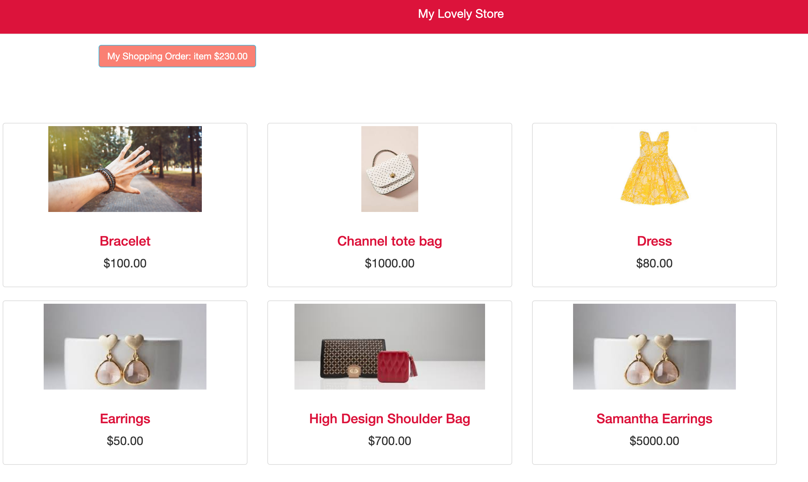

## My Lovely Store

This project is created during my time at Code Chrysalis when I learnt python on my own.
Fake Users API

It's a e-commerce website built in Django.

## Steps to get started

- Fork the repository
- Clone it on your local machine
- all dependencies are listed in requirements.txt
- install all dependencies
- cd myStore
- start the server python manage.py runserver
- Go to localhost to IP address specifies in console
